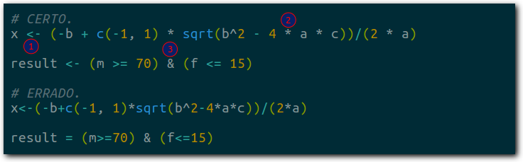
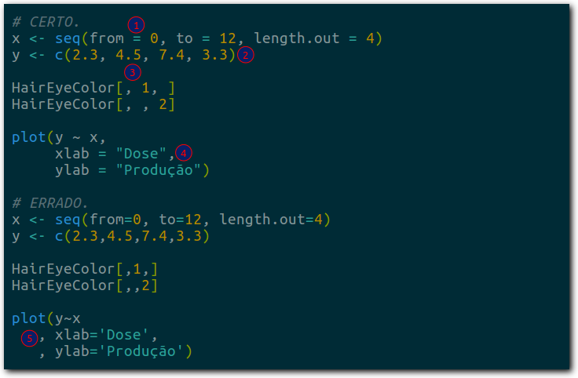
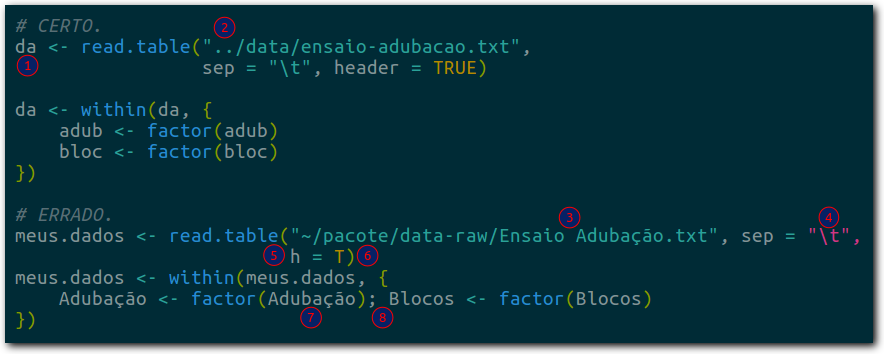
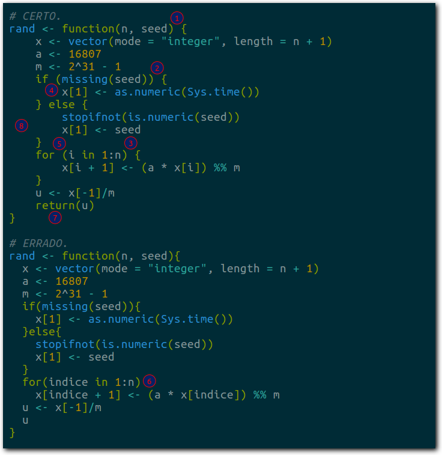
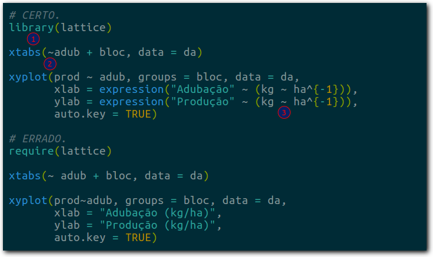
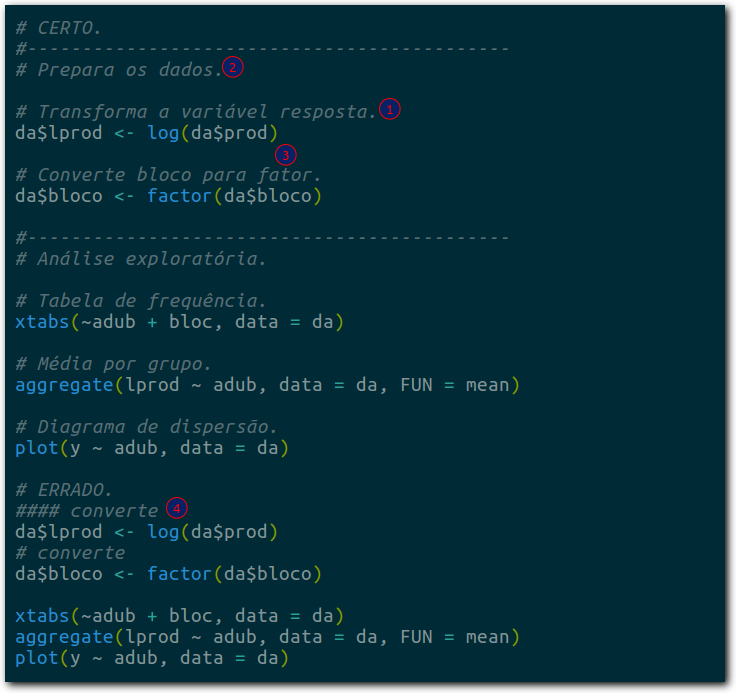

```{r setup, include=FALSE}
source("config/_setup.R")
```

O **Guia de Contribuição e Estilo** serve para orientar a forma de 
trabalhar que seja eficiente, padronizada, coordenada e segura e produza conteúdo de qualidade. Este guia contém orientações de como escrever o código e realizar contribuições.

## Estilo de Escrita de Código R

Os números circulados de vermelhos nas imagens abaixo indicam diferenças
entre os padrões de escrita de código R. Os dois fragmentos de código
fazem a mesma coisa, funcionam igualmente, porém o primeiro é o adotado
neste projeto.



1. Usar o operador `<-` e não o operador `=` para atribuir conteúdo aos
   objetos. Deixar espaço ao redor do operador `<-`.
2. Usar espaço ao redor dos operadores matemáticos: exceto `^` e `/`,
   todos os demais tem espaços ao redor: `+ - * %% %/% %*%`. Um caso
   particular é o `-` que não tem espaço quando é o negativo (`-5 * 2`)
   mas tem quando é o menos (`2 - 5`).
3. Usar espaço ao redor dos operadores lógicos:
   `== != > >= < <= & && | || %in%`.




1. Usar espaço para separar o argumento do valor que ele recebe.
2. Usar espaço após a vírgula e nunca antes dela.
3. A regra para a vírgula vale dentro de colchetes também. Duas vírgulas
   não ficam coladas.
4. Usar aspas duplas. Usuários experientes afirmam que a dupla é mais
   visível por ser um caractere mais cheio. Na linguagem R não existe
   nenhuma diferença de função entre elas.
5. Em algumas linguagens de programação há quem goste do estilo *comma
   first*. No entanto, além de não haver um argumento forte para, não é
   esse o padrão adotado pelos programadores de R. Não recomenda-se o 
   uso de *comma first*.




1. Usar nomes curtos. A chance de erro de digitação com eles é menor.
   Tente abreviações e siglas para definir os seus objetos, evitando 
   nomes que excedam 6 caracteres. Quando houver necessidade de nome
   composto, pode ser usado `.` e o `_`. 
2. Usar endereços relativos porque isso deixa o código com
   mais portabilidade.
3. Evitar 1) espaço no nome de diretórios e arquivos, 2) caracteres
   acentuados (não ASCII) e 3) letras maiúsculas para diminuir os
   erros de digitação. No lugar dos espaços recomenda-se usar
   *underline* ou traço.
4. Evitar ultrapassar 72 caracteres no comprimento das linhas do
   código. Isso deixa o código mais vertical e legível, não esconde
   texto para monitores de pequena resolução, evita quebras de linhas
   acidentais quando o texto é colado em processadores de texto ou
   e-mail.
5. Não abreviar o nome dos argumentos. O seu código fica mai
   portável (menos sujeito a erro e ambiguidade) além de ser melhor
   compreendido por um usuário não familiar com a linguagem ou com a
   função que você está usando.
6. Não abreviar para `T` ou `F` os valores lógicos `TRUE` e `FALSE`. Os
   últimos são palavras reservadas do sistema mas os primeiros são
   apenas objetos, ou seja, nada impede de fazer `T <- 10` e isso pode
   causar confusão. 
7. Evitar definir objetos ou nomes das variáveis em `data.frames` com
   maiúsculas. O R é *case sensitive* e as chances de erro de digitação
   são maiores.
8. Evitar usar `;`. Ele é um operador que permite escrever duas 
   instruções na mesma linha mas isso faz crescer horizontalmente, 
   pode ultrapassar as margens.




1. Nas construções como `function`, `if`, `for`, `while`, etc, deixar
   espaço entre o parentese direito e chave esquerda.
2. O padrão de uso de chaves no R é o [K&R] 1TBS (*the one true brace
   style*). Nesse padrão de chave, o construtor (`if`, `for`, `while`,
   etc) antecede a chave que abre e chave que fecha fica sozinha na
   linha (indentada com o construtor), a menos que esteja acompanhada de
   um cláusula `else`, de outra chave ou parêntese.
3. Idem ao 1 e 2.
4. Deixar espaço entre o nome do construtor e o parêntese que abre. A
   única exceção é para `function`.
5. Idem ao 4.
6. Evitar deixar as construções como `function`, `if`, `for`, `while`,
   sem as chaves mesmo que o corpo seja uma linha curta. As chaves
   evitam que linhas adicionadas acidentalmente provoquem erros e
   deixam o código mais claro.
7. Usar o `return` no final das suas funções porque isso marca melhor o
   que a função retorna. 
8. A indentação padrão no R é com 4 espaços (e não com TAB). O RStudio,
   por exemplo, vem com 2 espaços por padrão. Pode-se mudar isso no
   `Global Options > Code > Editing`. 




1. Usar `library` e não `require`. Apesar do último parecer mais 
   lógico por ser um verbo, `library` é que carrega um pacote. Se o 
   pacote não estiver presente, a `library` retorna um
   **Error** (!) e a `require` retorna um `FALSE`.
2. O `~` é um operador como o `-`: tem espaço se existe um objeto que o
   precede, caso contrário não tem.
3. Preferir notação científica nos gráficos. Uma grande vantagem do R é
   permitir anotação matemática neles. 




1. Para o benefício de todos, é bom comentar o código. Encare os
   comentários como um texto normal e siga as regras do idioma: 
   acentue, comece com maiúscula, etc. 
2. Quando for o caso, separar o código em "seções temáticas". Use
   algo para destacar isso, como uma linha horizontal. 
3. Deixar linhas em branco para separar o código. Não empilhar código 
   que não seja logicamente conectado pois os espaços funcionam como o
   intervalo entre dois parágrafos de texto.
4. Usar o mesmo número de caracteres para fazer comentários. Todos os
   editores de R usam um sinal de `#`, que é mais barato. 

## Contribuição 

Para colaborar neste projeto, basta:

  > 1. Clonar o repositório;
  > 2. Criar o seu próprio *branch*;
  > 3. Fazer as edições desejadas e subir para o repositório no *git*;
  > 4. Fazer um *pull request*.